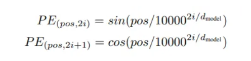
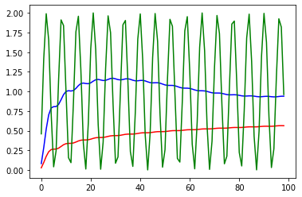
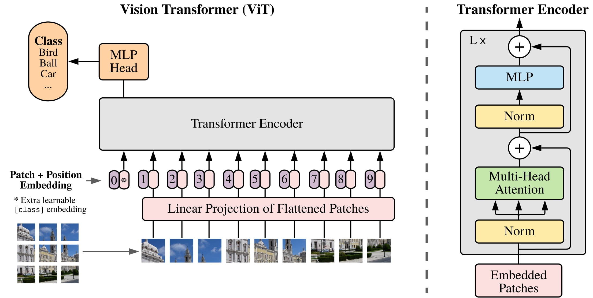
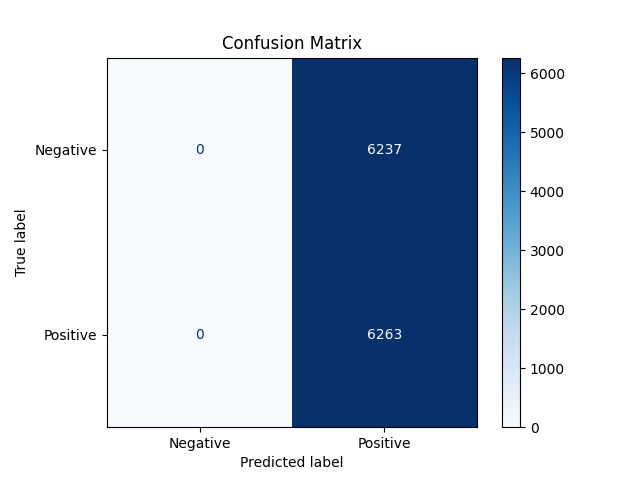
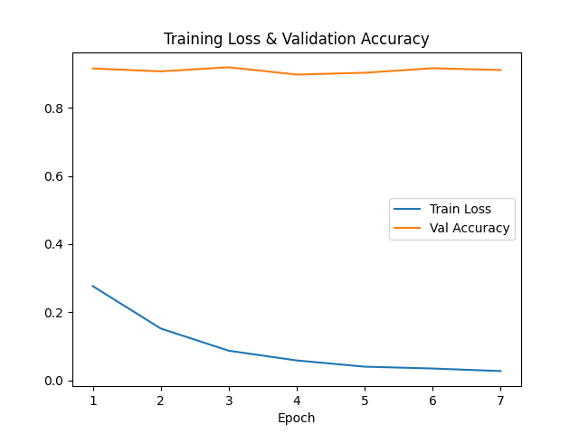
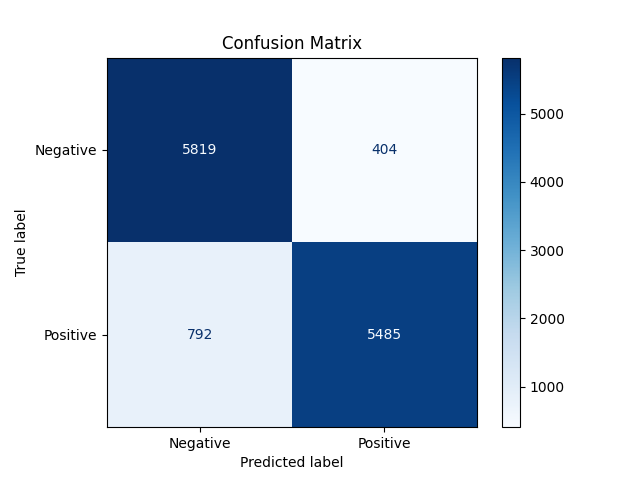
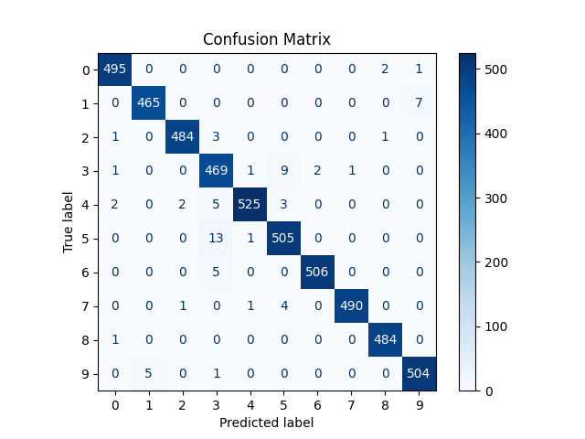
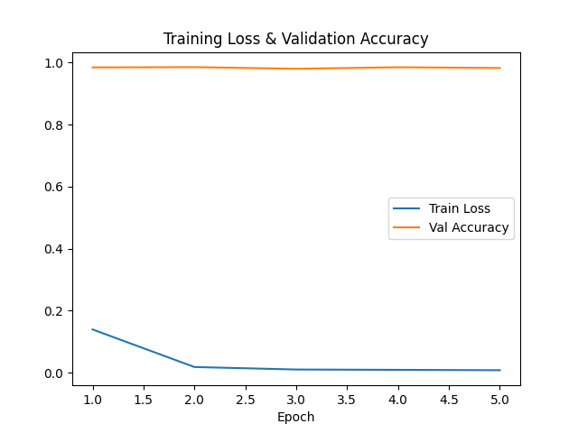

# lab3 - Exploring Transformers for Natural Language Processing and Vision Tasks


##  Part 1: Basic Theory of Transformers
### Main Parts of Transformers
#### Self-Attention Mechanism
Each word gets three parts: a query, a key, and a value. Think of the query as a question from a word, and the key as the secret code of every word. When a query finds a key that matches very well, its value is used in the result. We divide the matching score by the square root of the key’s size to keep things steady. Also, with masked self-attention, the model only looks at words before the current one so it can build its answer step by step.

#### Multi-Head Attention
Next, the data goes into multi-head attention. This means the model looks at the whole sentence from several different angles at once. In the decoder, first the word ideas (embeddings) get a special tag called positional encoding, then they go through multi-head attention. After that, the model adds the original input back and normalizes it (add & norm). Then it does another round of multi-head attention followed by another add & norm step.

#### Positional Encoding
Before the model works with the words, it needs to know where each word is in the sentence. In the encoder, the word embeddings get positional encoding using sine and cosine functions. The same process is done in the decoder for the output words.

#### Feedforward Layers
After multi-head attention, the model uses another add & norm step to mix the original input with the new data. Then, the data goes into a feedforward network. This is a simple neural network that first transforms the data with a linear layer, then applies a ReLU activation (a way to add non-linearity), normalizes again, and finally adds the original input back once more. The final step is to pass the data through another linear layer and then use a softmax function, which turns the results into probabilities for each possible output word.

### Variants of Transformers: 

#### BERT (Bidirectional Encoder Representations from Transformers) for NLP.
Bert use only the encoder part of the tranfromer to predict a missing word in a sentences. Indeed BERT use a Masked LM method to mask random world in the sentence and predict it with what is before and afert this.

Before applying the transformers, the sentence is tokenized and a [SEP] marker is placed between each sentences. A [CLS] token is also placed a the beggining of the text, it represent the global context of the whole text, so each words is computed in regard of the sentence meaning and the global meaning. 

A positional encoding is also added to represent the order of each token.



$pos$ is the position of the token
$i$ the index of the element inside a token.
$d_{model}$ the output embeding space

--

$10000$ was chosen is **Attention is all you need** vary smoothly across the embedding dimensions.


*orange:* n = 10000 
*blue:* n = 20 
*green:* n = 1


For this, we use periodic function like $sin$ because it is :

* Normalized between $[-1,1]$
* Unicity : each position is normalized uniquely because each token composants are represented with a different unique wavelenght
* same functon are used for each embedings, it allow the comparison between tokens position.

#### Vision Transformers (ViT) for images.


The images are projected into patches by a learned linear layer (with [CLS] and [SEP]) along with positional embeddings. Learning the relation of each individual pixel can be computationally intensive so we "tokenise" the image into patches. The transformer then discovers the relationships between these patches via its attention mechanism. The output from the encoder and subsequent MLP block is finally sent to a classification layer. In this way, the transformer captures both global and internal relationships between the image elements, efficiently modeling long-range dependencies without processing every pixel individually.


## Part 2: Implementing a Transformer for NLP 
See the script  ```TransformerNLP.py```

### Training 

Training parameters:
* 3 epochs (5 hours)
* Batch of 64

### Evaluation 


Due to the low number of training epochs, the loss did not converge and the validation accuracy is 0.500. The model is biased; it looks like the model is correct on the sentiment of 50% of the sentences in the dataset.



Looking at the confusion matrix, it looks like the model gives the same answer for every sentence; let's confirm this using inference.

### Inference

We try the model on the following sentences:

* "This movie is horrible."
* "This movie is excellent."
* "This movie is horribly excellent!"


```python TransformerNLP.py --inference --input_text "This movie is horrible."```

```
==== Output =====
This movie is horrible.
The text 'This movie is horrible.' is overall Positive with probability 0.5253835320472717
```


```python TransformerNLP.py --inference --input_text  "This movie is excellent."```

```
==== Output =====
This movie is excellent.
The text 'This movie is excellent.' is overall Positive with probability 0.5253545641899109

```
```python TransformerNLP.py --inference --input_text "This movie is horribly excellent!"```

```
==== Output =====
This movie is horribly excellent!
The text 'This movie is horribly excellent!' is overall Positive with probability 0.5252048373222351

```

The probability result is nearly the same between input texts even though their sentiment differs; the model lacks proper training.

### Oh 

After more epochs and same result, I deducted that my model wasn't learning (loss ≈ 0.69 and accuracy ≈ 50%). After investigation I discover that keras use word index instead of natural language. I remapped the sentences.

Before:
```
def preprocess_data(x_data, tokenizer, max_length=256):
    texts = [" ".join(map(str, review)) for review in x_data]
    encodings = tokenizer(texts, padding=True, truncation=True, max_length=max_length, return_tensors="pt")
    return encodings
```

After:
```

def preprocess_data(x_data, tokenizer, max_length=256):
    # Load the word index mapping from Keras
    word_index = tf.keras.datasets.imdb.get_word_index()
    
    # Create a reverse mapping, noting that the indices are offset by 3
    index_to_word = {i+3: word for word, i in word_index.items()}
    index_to_word[0] = "[PAD]"
    index_to_word[1] = "[START]"
    index_to_word[2] = "[UNK]"
    index_to_word[3] = "[UNUSED]"
    
    # Decode each review from integers to words
    texts = [" ".join([index_to_word.get(i, "[UNK]") for i in review]) for review in x_data]
    
    # Tokenize the decoded text
    encodings = tokenizer(texts, padding=True, truncation=True, max_length=max_length, return_tensors="pt")
    return encodings
```

### retraining 

```
Epoch 1/7 - Loss: 0.2764 - Val Accuracy: 0.9152
Epoch 2/7 - Loss: 0.1520 - Val Accuracy: 0.9067
Epoch 3/7 - Loss: 0.0869 - Val Accuracy: 0.9187
Epoch 4/7 - Loss: 0.0584 - Val Accuracy: 0.8973
Epoch 5/7 - Loss: 0.0401 - Val Accuracy: 0.9026
Epoch 6/7 - Loss: 0.0347 - Val Accuracy: 0.9160
Epoch 7/7 - Loss: 0.0272 - Val Accuracy: 0.9105
```
It's better now





### Reinference

```
This movie is horrible.
The text 'This movie is horrible.' is overall Negative with probability 0.9998928308486938
```
```
This movie is horribly excellent!
The text 'This movie is horribly excellent!' is overall Positive with probability 0.9219653010368347
```

```
This movie is excellent.
The text 'This movie is excellent.' is overall Positive with probability 0.9996683597564697
```

## Part 3: Applying Vision Transformers (ViT)

### Training 

Training parameters:
* 5 epochs (10 hours)
* Batch of 32

### Evaluation

   
Even with only 5 epochs, the predicted labels on the validation set are really good. We note that most errors are due to confusion between dogs (5) and cats (3).



The accuracy is very high in the first epoch.

### Inference

Let's test the model with a random cifar cat image:


```python ViT.py --inference --image_path cifar_image.jpg```

output:
```
Probabilities: tensor([[1.0713e-05, 1.6281e-05, 1.2965e-05, 9.9971e-01, 8.6661e-06, 1.1069e-04,
         5.4487e-05, 2.9045e-05, 2.7793e-05, 2.3811e-05]])
Predicted Class: 3 - cat
``` 

### Part 4: Reflection and Discussion (30 minutes)


#### 1. What are the differences in how Transformers process text versus images? 

The images is divided by patches (like 16x16 patches for a 32x32 images) before vectorisation while text is tokenized. The main difference is the input representation, text token are discret while patches are continuous due to the overlapping (token are 1D while patches are 2D).

#### 2. How does the self-attention mechanism adapt to different data modalities? 

For text, the self-attention mechanism compares the semantic meaning between tokens by computing relationships with queries, keys, and values—to determine which words in a sentence are most relevant to each other. This allows the model to capture context and long-range dependencies.

For images, instead of  process every pixel, the image is divided into fixed-size patches that are flattened and projected to embedings dim. The self attention then compares these patch computing the relationships between different regions of the image—to capture both local details and global context.

#### 3. What are the limitations of Transformers, and how can they be mitigated?

As we seen during the training, the process work really well for image classification with less epochs. But it's the model was kinda heavy and need a lot of data to do what CNN can do natively.