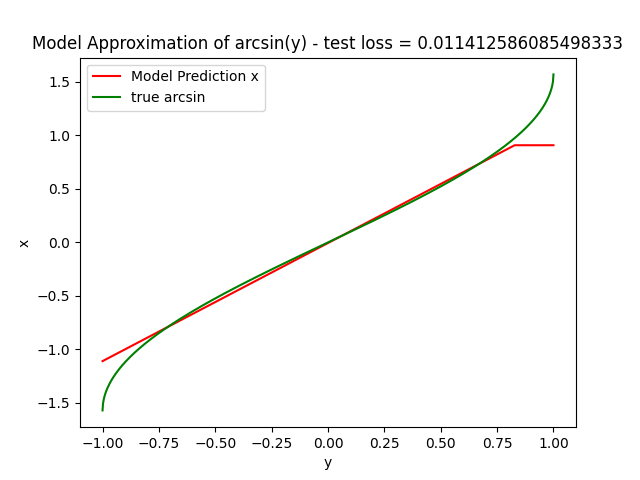
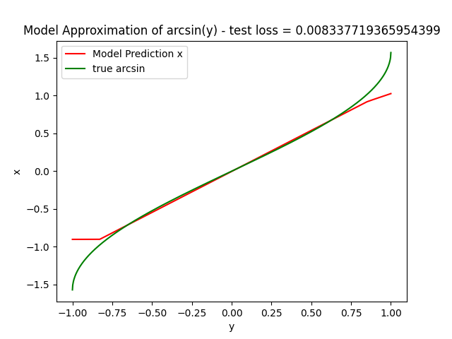
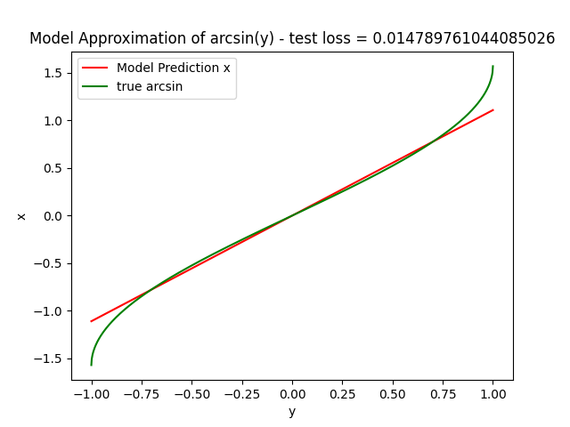
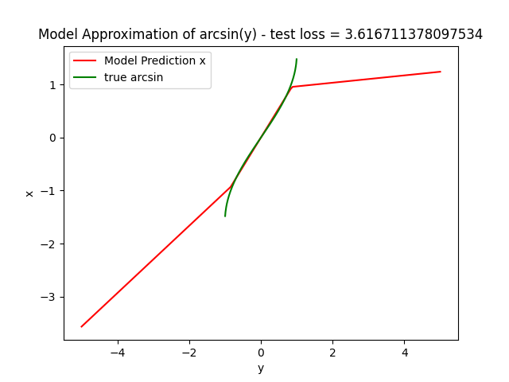
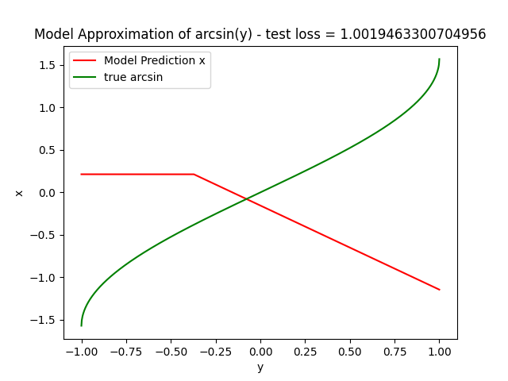

# Lab 4 -  Introduction to Stable Diffusion Models

## Part 1: Preliminary Activity - Neural Network for Function Inversion

In this part we try to approximate the inverse of $x=\sin(y)$, so $y=arcsin(x)$  

### Dataset

We use a uniform distribution of random number between -1 and 1 as a X and $y = sin(X)$

```X = np.random.uniform(-1, 1, n) ```
```y = np.sin(X)```

### Model

I used 3 model

1. Single ReLU
2. 
   * 1 input neuron (for y),
   * 1 hidden layer (3 neurons, ReLU activation)
   * 1 output neuron (for x).
  
3. Double ReLU
   * 1 input neuron (for y),
   * 2 hidden layer (3 neurons, ReLU activation)
   * 1 output neuron (for x).

4. simple linear
   * 1 input neuron (for y),
   * 1 hidden layer (3 neurons, linear activation)
   * 1 output neuron (for x).

* Loss MSE

### Training 

```model = train_model(model, y, X) ```
training parameter :
* trained on y 
* 1000 epochs with early stopping on loss

### Evaluation

1. Single ReLU


2. Double ReLU


3. Single Linear



The double ReLU have the lowest MSE.

The 3 models estimate well the line between $[-0.7,0.7]$ but struggle to estimate the curve of the arcsin, it struggle to estimate the non-linear part of arcsin. It could be also linked to the distribution, maybe there is not enough data on the high curvature of sin.

## Key Discussion Points:


### What happens for values outside the range [-1,1]?

When we predict values outside $[-1,1]$ the model stay linear.




When we train values outside $[-1,1]$ the model lost performance even on the linear part, $arcsin$ is on $[-1,1]$, it's mostly because the model is noisier to do the inverse.




### What are the implications of approximating inverses in more complex functions ?

On more complex function we have similar challenge :

* Unpredictability outside the domain.
* Harder prediction on non-monotonous function (so harder on complex functions).


## Part 2: Diffusion Models on Images

run the code : 
```
python diffusion.py --epochs 100 --batch_size 64 --model minimal 
```
```
python diffusion.py --epochs 100 --batch_size 64 --model sinus --time_emb_dim 256 
```
## Dataset

MNIST dataset for simplicity and easier benchmarking than CIFAR

### Models 

Two minimal U-Net with convolution, maxpooling, upsampling and a concatenation at the output layer (see comments on code ).

An Embeddings is used to represent the timestep to transmit the time information (so the noise level) through the model.

for the minimal model we use a linear time embeddings. In the Sinus Model we use a sinusoidal function to represent time, cyclic signal is also used in transformer for positional encoding. It allow model to generalize better through different timestep.

#### input

A timestep t & a 28 x 28 image with a level of noise corresponding to the timestep ( we use a list of alphas to generate the right temporal noise)

#### output

A noise extracted from the input image; to denoise the image we remove the model output to the noisy image

### training

We create a noisy image at a random timestep, we predict the noise of the image with the model and we calculate the loss (MSE) between the noise and the noisy image.


### inference 

We create a random noise, for a range of timestep we predict the noise we remove to the image, then we repass the image inside the model until the end of the time step in a decreasing way, from biggest noise level to smallest noise level

### results & evaluation


#### training results

after 100 epochs at batch 64

Minimal Model : ```0.0769```

Sinus time embedding Model : ```0.0536```


#### Denoising Results


Minimal Model output at each timestep


Sinus time embedding Model output at each timestep


We can note that the loss is tinier on the sinus time embedding model, the edges are more defined and we lost less information.

#### Inference Results


Minimal Model output at each timestep


Sinus time embedding Model output at each timestep


Both inference are not really well defined and random, however it seems that the minimal model have more things going on.

### discussion

#### What happens if we change the noise schedule ?

Changing the timestep length, the noise level, or the function used (linear vs cosine) refines the image more gradually with a longer timestep. With a timestep of 1, the process can behave like a classic GAN.

### How do diffusion models compare to GANs?

Diffusion models work step by step: they slowly remove noise over several steps. GANs, on the other hand, create the image all at once without using any timesteps. Diffusion models take longer to train but are often more stable, while GANs can be faster but may have issues like mode collapse.


## Final Reflexion

### How does function inversion relate to diffusion models ?

For predicting new image or denoising, instead of inversing the $sin$ function we iterativelly inverse the noise addition function.

### How does iterative noise removal help generate realistic images?

Removing a little bit of noise at each step enable better correction, keeping the detail and overall structure to be intact, indeed the process is more stable than generating one shot image.

### Potential applications of diffusion models (e.g., text-to-image generation like Stable Diffusion).

* Text-to-image generation: Just like Stable Diffusion, these models can generate detailed images from textual descriptions by concatinate label and associate them to a distribution.

* Text-to-Video generation : DreamDriver use a diffusion model to generate realistic driving POV videos based on a label, lidar and 3d data.
